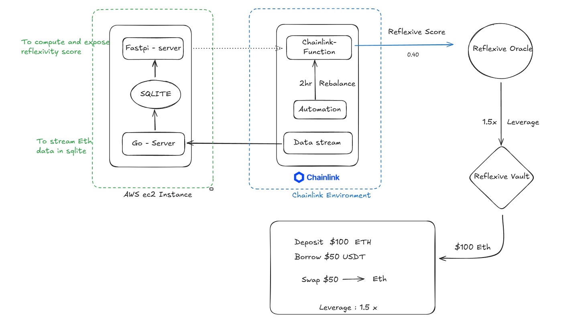

# Reflexive Vault (Backend)


Real-time Reflexivity Score powered by **Chainlink**, **AWS**, and **Soros' Reflexivity Theory**  
Track leverage cycles, market volatility, and systemic risk using decentralized data and transparent on-chain publishing.

---

### Chromium Hacks (Direct code link link)
- [Data Stream integration](https://github.com/AnkurKumarShukla/linkbackend/blob/a7762fbae0ae0298ee24ad36191506dacda43ca1/stream-app/main.go#L20)
- [Endpoint to estimate and expose reflexivity score](https://github.com/AnkurKumarShukla/linkbackend/blob/a7762fbae0ae0298ee24ad36191506dacda43ca1/py-api-app/main.py#L56)

- [Endpoint to read data streamed by data-stream](https://github.com/AnkurKumarShukla/linkbackend/blob/a7762fbae0ae0298ee24ad36191506dacda43ca1/py-api-app/main.py#L37)




## 📦 Tech Stack

| Category              | Technology                          |
|----------------------|-------------------------------------|
| Real-time Data Feed  | [Chainlink Data Streams (Go SDK)](https://chain.link/data-streams) |
| Data Storage         | SQLite (Lightweight DB)             |
| API & Processing     | [Python FastAPI](https://fastapi.tiangolo.com/) |
| On-Chain Integration | [Chainlink Functions](https://chain.link/functions) |
| Smart Contracts      | EVM-Compatible Blockchain           |
| Infrastructure       | Docker, AWS EC2                     |

---

## ⚡ Features

✅ Real-time decentralized market data ingestion  
✅ Computes Reflexivity Score based on Momentum, Volatility, and Open Interest Growth  
✅ Transparent on-chain publishing with Chainlink Functions  
✅ Secure, scalable deployment with Docker and AWS  
✅ Modular architecture for easy expansion  

---

More about solution : [Documentation](https://docs.google.com/document/d/1sdwQq9cpyK3YzQ1xSMgvZQW2y2AWSYIKEyzm9V6AAN8/edit?usp=sharing)

## 🛠️ Setup & Run Instructions

**Prerequisites:**  
- [Docker](https://docs.docker.com/get-docker/) installed  

**Steps to Run:**

```bash
git clone <your-repo-url>
cd <your-repo-directory>
docker compose up --build
```

API will be available at: [http://localhost:8000](http://localhost:8000) 

---

## 🌐 API Endpoints

| Method | Endpoint         | Description                          |
|--------|-----------------|--------------------------------------|
| `GET`  | `/streamrecords` | Fetch raw market data from SQLite    |
| `GET`  | `/reflexivity`   | Compute Reflexivity Score (requires `stream_id` query param) |

**Example:**

```bash
curl "http://localhost:8000/reflexivity?stream_id=123"
```

---


## 🎯 Reflexivity Score Concept

Based on **George Soros' Theory of Reflexivity**:  
Markets exhibit feedback loops where perceptions influence fundamentals, amplifying volatility and leverage cycles.

| Reflexivity Score | Market Interpretation                |
|-------------------|--------------------------------------|
| High              | Elevated leverage, instability risk  |
| Low               | Market stability, conservative phase |

---

## 🎬 Demo & Visuals

> ⚠️ For Hackathon: Add demo video link or screenshots here if available.  
Example:

## 🎬 Demo & Visuals

[](https://www.youtube.com/watch?v=j7hOQ1wxU3Q&autoplay=1)


---

## 🚀 Future Roadmap

- ☁️ Migrate to PostgreSQL/DynamoDB for scalable storage  
- 📊 Advanced dashboards & real-time visualizations  
- 🔗 Integrate multiple exchanges for broader market coverage  
- 🤖 ML-based dynamic indicator weighting  
- 💡 Full automation of smart contract trading logic  

---

## 🤝 Contributing

PRs and feedback welcome! For major changes, please open an issue first to discuss.

---

## 🛡️ License

This project is licensed under MIT - see the [LICENSE](LICENSE) file for details.

---


